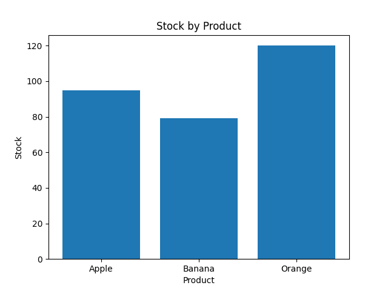

# 在庫管理システム（COBOL × Python）

## 概要
COBOLで在庫更新バッチを構築し、
Pythonで分析・可視化を行う在庫管理システムです。

## 使用技術
- COBOL（GnuCOBOL）
- Python
- pandas
- matplotlib
- Streamlit

## 機能
- 在庫更新バッチ
- 在庫分析
- グラフ表示
- ダッシュボード表示

## システム構成図
```text
+------------------+
| COBOL Batch      |
| update_stock.cob |
+------------------+
          |
          v
+------------------+
| master_new.dat   |
| Inventory Data   |
+------------------+
          |
          v
+------------------+
| Python Analysis  |
| pandas/matplotlib|
+------------------+
          |
          v
+------------------+
| Streamlit UI     |
| Dashboard        |
+------------------+
          |
          v
+------------------+
| Browser          |
| Web Application  |
+------------------+
```

## 処理フロー図

```text
+------------------+
| master.dat       |
| Inventory Master |
+------------------+
          |
          v
+------------------+
| sales.dat        |
| Sales Data       |
+------------------+
          |
          v
+----------------------+
| COBOL Batch Process  |
| update_stock.cob     |
+----------------------+
          |
          v
+------------------+
| master_new.dat   |
| Updated Inventory|
+------------------+
          |
          v
+----------------------+
| Python Analysis      |
| pandas/matplotlib    |
+----------------------+
          |
          v
+----------------------+
| Streamlit Dashboard  |
+----------------------+
          |
          v
+----------------------+
| Browser Display      |
+----------------------+
```
## COBOL × Python連携

本システムでは、COBOLによる在庫更新バッチ処理と、
Pythonによるデータ分析・可視化を連携による在庫管理を行えます。

### COBOLの役割
- 在庫更新バッチ
- 売上データ処理
- 固定長ファイル生成

### Pythonの役割
- pandasによる分析
- matplotlibによる可視化
- StreamlitによるWeb化

### 連携内容
COBOLで生成した在庫データを、
Pythonで分析・可視化しています。

## 技術選定理由

### COBOL
歴史の長いプログラミング言語でありながら、
現在もなお金融業や官公庁などで多く利用されているCOBOLの継続利用のため、
現代の主流プログラミング言語の一つであるpythonとCOBOLの連携を想定しています。

### Python
データ分析・可視化との親和性が高く、
モダン技術との連携を目的として採用しました。

### pandas
固定長ファイルの解析や
在庫データ分析を効率的に行うため採用しました。

### matplotlib
在庫状況をグラフ化し、
視覚的に把握できるよう採用しました。

### Streamlit
少ないコード量でWebダッシュボードを
構築できるため採用しました。

## 工夫したポイント

- COBOLによるレガシー業務処理と、Pythonによるモダン技術を連携しました。

- 実務を意識し、固定長ファイルによるデータ連携を採用しました。

- matplotlibを利用し、在庫状況を視覚的に把握できるようにしました。

- Streamlitを利用して、ブラウザ上で操作可能なダッシュボード化を行いました。

- GitHubおよびStreamlit Cloudへ公開し、実際にアクセス可能なWebアプリとして構築しました。

- COBOL未経験からの作成だったため難儀しましたが、データ連携可能なシステムとして形にできました。

## 画面イメージ

